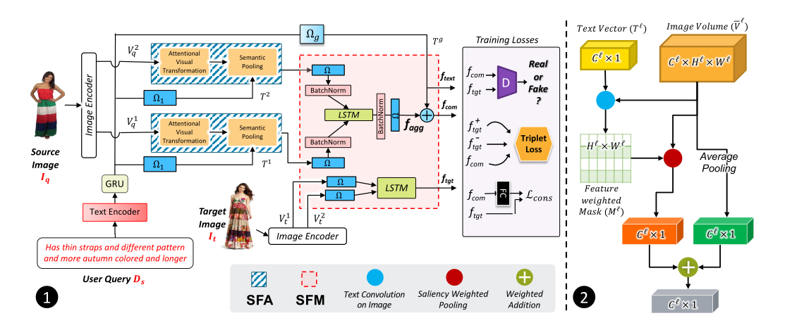
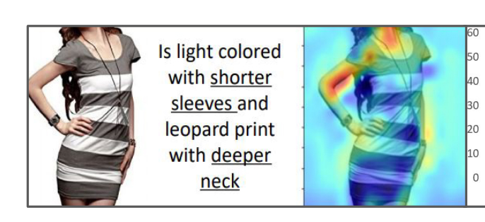

# 基于语义注意力合成的文本图像检索（SAC）

> conference: WACV
> year: 2022

## 摘要

**主要贡献**：

1. 引入两种模块（语义特征注意`SFA`和语义特征修改`SFM`），将文本修改图像检索的任务分为两个部分--“注意图像的哪个部分”和“如何更改图像特征”
2. 实验展示了两个模块如何工作
3. 在3个数据集上达到sota（**Fasion-IQ**等）

## 模型与方法

### 模型总览图

### Image Encoder

使用CNN一次性获得图片的低级特征和高级特征
$$
F_{img}=\{V_q^1,V_q^2\}=\phi_{CNN}(I_{src})
$$

### Text Encoder

使用GRU/BERT获取文本特征，然后并行通过两个全连接层以和图片的低级特征、高级特征相匹配
$$
F_{sent}=GRU(T_{src})
$$

$$
T^1,T^2=\Omega_1(F_{text}),\Omega_2(F_{text})
$$

### SFA

**主要思想**：相比传统的图像检索任务，使用融合层来学习复杂的模态转换特征，SFA仅关注一个任务，学习到关于文本，图片中每个像素的重要度（2维矩阵）。使用文本向量作为卷积核，卷积图像获得概率矩阵，然后根据文本的重要性加权计算特征。

**方法**：图像特征先经过self-attention，线性变换后获得中间特征，中间特征与文本特征线性相加，最后得到编码全局图像信息、选择性文本信息的注意力视觉表示$V_q^l$。然后与对应粒度的文本特征卷积，除以温度系数T后softmax，获得特征权重图。

### SFM

**主要思想**：为了解决如何修改语义，对两个不同级别的源图像进行采样，然后与文本特征一同输入模块，以获得跨模态的关系。

**方法**：不同粒度的图像特征进入SFM后，先分别进行线性投影和BatchNorm，然后按序输入LSTM中（希望特征由低级传递到高级），再进行BN之后再次线性投影得到$f_{agg}$。最后与线性投影后的文本特征向量计算组合特征向量$f_{com}$。其中用到了全连接和**L2范数**

通过以上所有模块，最后可得到3个特征向量分别为文本特征$f_{text}$，不同粒度图片特征的聚合特征$f_{agg}$，图片文本组合特征$f_{com}$。

### Loss

1. 鉴别器Loss（combine，target）
2. 三元组loss（正样本，负样本，combine）
3. 一致性Loss（从combine还原的图片和文本特征（线性投影），`与CycleGAN类似的手法，目的是为了更好约束`）

## 实验效果

击败composeAE和TIRG，分数大幅度提高

疑问：

1. text embedding选用随机的效果，与使用BERT训练出来的效果差距不大？
2. 效果来看，仅使用低级图像特征或高级图像特征，训练出来的效果差距较大。提取低级图像特征和高级图像特征时使用的是相同的模型，为什么仅使用高级图像特征效果更好？优点是不是位于LSTM中？

## 思考

- 优点

    1. 性能大幅度提高，text embedding似乎与实验结果关系不大

    2. 使用了一个很好的热力图说明注意力模块确实关注到文本的内容。

        

    3. 综合比较了参数量，再参数量未大幅度提高的前提下，分数仍大幅度领先composeAE和TIRG

- 缺点

    1. 低级图像特征和高级图像特征没有区分度，可不可以使用不同的特征提取器来提取不同粒度的特征

## TODO

- [x] L2范数？L2归一化？
- [ ] 使用Fasion-IQ数据集