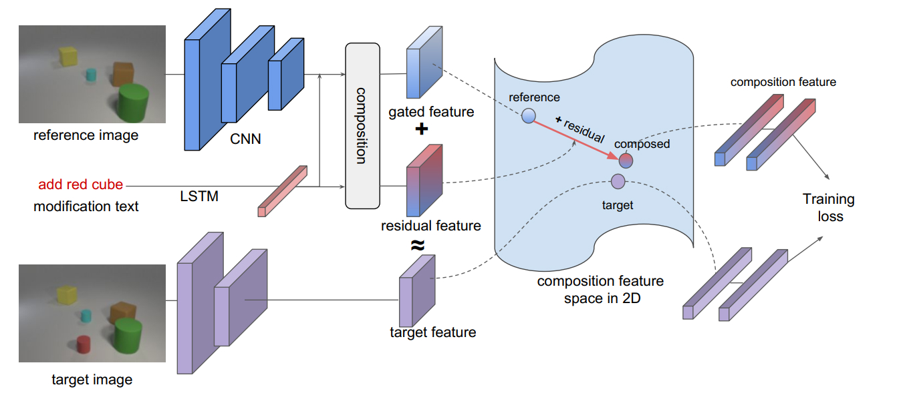

# Text Image Residual Gating(TIRG)

> conference: CVPR
> year: 2019

## 摘要

解决问题：给定一张源图片，一段更改源图片的文本描述，检索数据库中的目标图片。

使用相似度度量源图片与目标图片的关系。

## 介绍

使用深度度量学习(Deep Metric Learning, **DML**)，**三元组LOSS**

**主要贡献**：

1. 提出TIRG模型
2. 新的数据集CSS（好像用的比较少）
3. 图像检索和组合图像分类中达到sota

## 模型

> 图片特征：`ResNet-17`
> 文本特征： `LSTM`
> 融合器：残差门控（Resdual Gating）

1. 门控单元

$$
\phi_{xt}^{rg}=\omega_{g}f_{gate}(\phi_x, \phi_t)+\omega_{r}f_{res}(\phi_x, \phi_t)
$$

$$
f_{gate}(\phi_x, \phi_t)=\sigma(W_{g2}*RELU(W_{g1}*[\phi_x, \phi_t]))\odot\phi_x
$$

$$
f_{res}(\phi_x, \phi_t)=W_{r2}*RELU(W_{r1}*([\phi_x, \phi_t]))
$$

其中`*`为2d卷积

2. 深度度量学习（DML）

    待读论文

## 思考

- 优点
    1. 模型结构简单，计算开销比较小。
    1. 消融实验中关于DML Loss计算中，负样本的数量与模型训练出来的效果关系并不是很大，并不是负样本越多，模型效果越好。在两个数据集中使用triplet的效果更好（即一个正样本，两个负样本）
- 缺点
    1. 单向的LSTM获取特征的能力弱于双向LSTM或BERT之类的模型，一定程度影响了模型的效果
    2. 结构图不够清晰

## 其他论文的融合器

1. Concatenate：两层的MLP
2. Show and Tell：训练一个LSTM融合图片和文本，图片特征向量和文本向量直接相连
3. Operator：将文本特征视为转换源图像的转换矩阵
4. Parameter Hashing：视觉问答领域（Visiual Question Answering, VQA）文本特征哈希后视为源图像的转换矩阵
5. Relationship：（VQA）
6. FiLM：（VQA）

## TODO

1. 阅读有关DML的论文
1. 阅读有关zero-shot的综述论文
