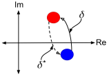
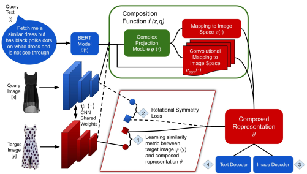

# 图像检索中的图像文本查询-组合学习

> conference: WACV
> year: 2021

## 摘要

解决问题：给定一张图片和一个文本描述，文本描述中是对给定图像的修改，需要检索到修改后的图片。

关键词：**自动编码机**，**深度度量学习**，**优化问题时采用旋转对称约束**，**复数空间投影**	

## 介绍

图片-文本检索常用于电商平台检索、监控系统、网络搜索等应用。

**TIRG**模型虽然在多模态图像检索中达到了SOTA，但在实际任务中表现并不好，主要原因可能有，该模型过于专注于图像，而并没有给文本相对应的重视。然而在实际任务中，文本描述通常较长且具体（本文中使用的文本平均长度14词），丢失了这样一部分重要的信息之后，模型的效果并不会很好。

> 组合模态方法：组合自动编码机（composeAE）
> 文本特征：BERT
> 图像特征：ResNet-17

使用全连接层组合不同模态的特征效果不明显，采用映射不同模态的特征到同一个复数空间中的方法。

**主要思想**：将目标图像和源图像映射到复数空间，认为目标图像表征是源图像表征在复数空间的旋转，旋转的角度则由文本描述来确定。

使用**深度度量学习**（Deep Metric Learning, DML）来学习复数向量以及映射

## 相关工作

DML 被广泛应用于图像检索（搜索DML的论文），DML旨在学习到一个度量来保证，同类的图像复数空间上的距离会小于不同类的图像。

## 方法

1. 公式，计算目标图像特征和经源图像与源文本组合表征的最大相似度。

2. 采用复投影的动机

    - 可以定义提出的**旋转**，而**旋转**时采用的文本描述得到的特征，也可以被定义为复数共轭。（可能方便于计算或量化？）

    - 可以定义优化问题时的约束，即旋转对称约束
    - 图像无需用户额外提供信息，这个在实际应用时十分重要

3. 网络结构

    

    需要将源图像和目标图像映射同一个复数空间，而文本的特征向量为一个将源图像旋转到目标图像的`函数`？

    - 文本通过`BERT`得到特征向量  $q \in \mathbb{R}^h$
        $$
        \delta = \varepsilon\{j\gamma(q)\}
        $$
        其中$j=i$, $\gamma$为二层的无激活函数的MLP，参数可学习。$\varepsilon$为指数函数，通过以上公式将，文本的特征向量转换为旋转矩阵。
        
    - 图片通过`Resnet-17`得到特征向量  $z \in \mathbb{R}^d$
        $$
        \phi = \delta\eta(z)
        $$
        其中$\eta$为MLP，它将$z$转换到向量空间，而后与旋转矩阵相乘，可得到预期的，源图像在复数空间中的位置。
        
	- 但是此时目标图像的特征向量是在实数空间中的，所以需要一个学习一个映射，将图像从复数空间映射回实数空间。除此之外，仍期望保留一定的文本信息，定义映射时，文本同样作为其中一个输入，定义如下一个$f(z,q)$
        $$
        \upsilon=f(z,q)=a\rho(\phi)+b\rho_{conv}(\phi,z,q)
        $$
        其中$\rho()$为MLP，$\rho_{conv}$为两层MLP+卷积+最大池化，$a,b$为可学习参数。$v \in R^d$为组合后的特征向量。至此可以计算源图像和目标图像的相似度并计算loss。
        
        最后从$\upsilon$中重新解码出文本特征向量和图像特征向量。
    
    - 计算Loss
    
        - `base Loss`（与数据集的设置有关）
    
            1. MIT-States
                $$
                L_{ST} = \frac{1}{MN}\sum_{i=1}^{N}\sum_{m=1}^{M}\log\bigg\{1+exp\{\kappa(\upsilon_i, \psi(\hat{y_i}, m))-\kappa(\upsilon_i, \psi(\hat{y_i}))\}\bigg\}
                $$
                其中$M$表示每个训练样本的`triplet`数量
        
            2. Fashion200k & Fashion IQ 
                $$
                L_{SMAX} = \frac{1}{N}\sum_{i=1}^{N}-\log\Bigg\{\frac{\exp\{\kappa(\upsilon_i,\psi(y_i))\}}{\sum_{j=1}^{N}exp\{\kappa(\upsilon_i,\psi(y_i))\}}\Bigg\}
                $$
        
        - `decoder Loss`
        
            1. 图像的特征向量与解码出来的图像特征向量
                $$
                L_{RI} = \frac{1}{N}\sum_{i=1}^{N}\|z_i-\hat{z_i}\|_2^2
                $$
        
            2. 文本的特征向量与解码出来的文本特征向量，同上
        
        - `旋转对称性Loss`
            $$
            \delta^{\star} = \varepsilon\{-j\gamma(q)\}
            $$
        
            $$
            \tilde\phi = \delta^{\star}\eta(\psi(y))
            $$
        
            $\psi(y)$为目标图像的特征向量
            $$
            \upsilon^{\star}=f(\psi(y),q)=a\rho(\tilde\phi)+b\rho_{conv}(\tilde\phi,\psi(y),q)
            $$
            $L^{SMAX}_{SYM}$和$L^{ST}_{SYM}$的计算方式与`base Loss`相同

​        最终loss的表达式如下：
$$
L_T=L_{BASE} + \lambda_{SYM}L_{SYM}^{BASE}+\lambda_{RI}L_{RI}+\lambda_{RT}L_{RT}
$$

## 思考

- 优点

    1. 有较大的提升
    2. 与改良过的TIRG（其提升可能来自于BERT获取图片标题的信息）结果相近
    3. 忽略掉图片标题的信息之后仍能取得较好的结果

-  缺点

    1. 模型较为复杂，计算开销较大。
    2. 文本与图像的信息在复数空间和实数空间来回变动，可能会损失掉原有的信息。
    3. 计算Loss时不同的数据集中计算的方式不同。
    4. 缺少一个简洁明了的图示结构。

## 

## TODO

1. 查看本文中不同的数据集如何设置
