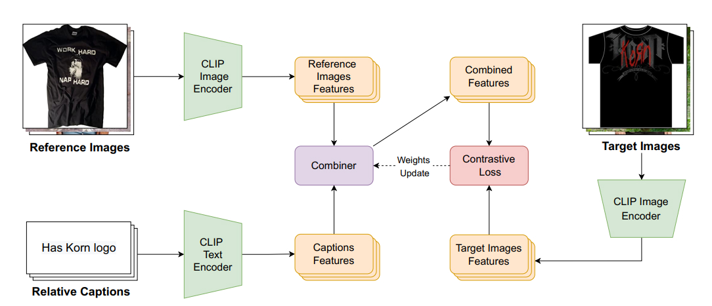
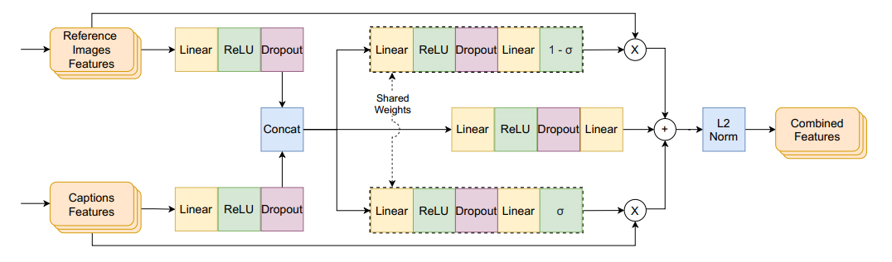

# 特征基于CLIP的条件组合图像检索-组合学习

> conference: CVPR
> year: 2022

## 摘要

**解决问题**：给定一张源图片和一段简短的文字描述，检索数据库中的一张图片。
**关键工作**：使用OpenAI 的预训练模型CLIP来获取图片和文本的特征，**对比学习**，基于内容的图像检索（Content-Based Image Retrieval, **CBIR**），可学习层融合特征

## 介绍

**主要困难**：解决检索图片时，图片的高级语义特征与获取到的图片特征向量的低级语义特征的语义缺失（获取特征的时候，源图片包含的某些重要信息在计算的过程中丢失掉了）
**主要思想**：学习一种图像和文本特征的流形，学习到在相同空间中进行相加变化，而不添加任何的空间信息

## 方法与结构

**假设**：图片与文本在同一个嵌入空间内，原因为表现同一个事物的文本和图像，在嵌入空间中可认为表现同一位置或接近。

**网络结构**：

**组合器结构**：

> 图像特征：`Clip Encoder -> ResNet-50`
> 文本特征：`Clip Encoder -> Transformer`
> Loss： `Batch-Based Classfication(BBC)?`

## 思考

- 优点

  1. 模型简单，计算开销较小
3. 使用更好的预训练模型来提取特征，效果显著
- 缺点（暂时没想到）

## TODO

1. ~~阅读TIRG的论文~~
1. 阅读CLIP的论文

